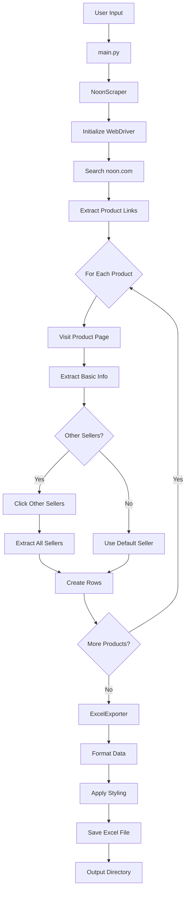

# Noon Web Scraper

A Python-based web scraper for noon.com that extracts product listings with multi-seller support and exports data to Excel format.

## Features

- Keyword Search: Search for any product keyword on noon.com
- Multi-Seller Support: Automatically detects and captures all sellers for each product
- Comprehensive Data: Extracts 9 fields per product-seller combination
- Excel Export: Formatted Excel output with auto-adjusted columns
- Smart Scraping: Includes delays and human-like behavior to avoid bot detection
- Progress Tracking: Real-time progress updates during scraping

## Requirements

- Python 3.7+
- Chrome browser installed
- Internet connection

## Installation

1. **Clone or download this repository**

2. **Install dependencies**:
   ```bash
   pip install -r requirements.txt
   ```

   This will install:
   - `selenium` - Web automation
   - `webdriver-manager` - Automatic ChromeDriver management
   - `pandas` - Data manipulation
   - `openpyxl` - Excel file creation

## Usage

### Basic Usage

Run the scraper:

```bash
python main.py
```

Follow the interactive prompts:
1. Enter search keywords (one per line)
2. Optionally set a limit for products per keyword
3. Confirm and start scraping

### Example Session

```
Keyword 1: iphone
Keyword 2: samsung galaxy
Keyword 3: done

Limit products per keyword? (Enter number or press Enter for all): 10

Proceed with scraping? (yes/no): yes
```

## Output

### Excel File

The scraper creates an Excel file in the `output/` directory with the following format:

| Search Keyword | Category | Title | Description | Price | Rating | Reviews | Seller | Product URL |
|----------------|----------|-------|-------------|-------|--------|---------|--------|-------------|
| iphone | Electronics > Mobiles | iPhone 16... | 128GB, White... | AED 3,999 | 4.6 | 12.8K | noon | https://... |

**Note**: Products with multiple sellers will have one row per seller.

### File Naming

Files are named with timestamps:
- Single keyword: `noon_scraper_iphone_2026-01-09_13-30-45.xlsx`
- Multiple keywords: `noon_scraper_2026-01-09_13-30-45.xlsx`

### Example Output

Here's a sample of what the scraped data looks like:

| Search Keyword | Category | Title | Description | Price | Rating | Reviews | Seller | Product URL |
|----------------|----------|-------|-------------|-------|--------|---------|--------|-------------|
| iphone | Electronics > Mobiles & Tablets | Apple iPhone 16 Pro Max | 256GB, Natural Titanium, 5G | AED 5,099 | 4.8 | 2.3K | noon | https://www.noon.com/... |
| iphone | Electronics > Mobiles & Tablets | Apple iPhone 16 Pro Max | 256GB, Natural Titanium, 5G | AED 5,199 | 4.8 | 2.3K | TechStore | https://www.noon.com/... |
| iphone | Electronics > Mobiles & Tablets | Apple iPhone 15 | 128GB, Black, 5G | AED 3,299 | 4.6 | 12.8K | noon | https://www.noon.com/... |

**Note**: Products with multiple sellers appear on separate rows with different prices and seller names.

## Data Fields

1. Search Keyword: The keyword used to find the product
2. Category: Product category from breadcrumbs (e.g., "Electronics > Mobiles & Tablets")
3. Title: Full product title
4. Description: Product highlights/description
5. Price: Product price (varies by seller)
6. Rating: Product rating (1-5 stars)
7. Reviews: Number of reviews
8. Seller: Seller name (e.g., "noon", "TechStore")
9. Product URL: Direct link to product page

## Configuration

Edit `config.py` to customize:

- Timeouts: Adjust wait times for page loading
- Delays: Modify delays between requests
- Selectors: Update CSS selectors if website structure changes
- Output: Change output directory or filename format

## Troubleshooting

### Common Issues

1. ChromeDriver not found
- The script automatically downloads ChromeDriver
- Ensure Chrome browser is installed

2. No data scraped
- Check internet connection
- Verify noon.com is accessible
- Review `scraper.log` for detailed error messages

3. CAPTCHA appears
- The scraper includes delays to avoid detection
- If CAPTCHA appears, you may need to solve it manually
- Consider increasing delays in `config.py`

4. Selectors not working
- noon.com may have updated their website structure
- Update CSS selectors in `config.py`
- Check `scraper.log` for specific errors

### Logs

Check `scraper.log` for detailed execution logs and error messages.

## Project Structure

```
revent-automation-assignment/
├── main.py                 # Main entry point
├── noon_scraper.py         # Core scraper logic
├── excel_exporter.py       # Excel export functionality
├── config.py               # Configuration settings
├── requirements.txt        # Python dependencies
├── README.md              # This file
├── output/                # Excel output directory (created automatically)
└── scraper.log           # Log file (created automatically)
```

## Technical Details

### Architecture Diagram



### Scraping Logic & Architecture

#### 1. **Search Flow**
```
User Input → Search noon.com → Extract Product Links → Visit Each Product → Extract Details → Export to Excel
```

The scraper follows a systematic approach:
1. **Keyword Search**: Navigates to noon.com and searches for user-provided keywords
2. **Product Discovery**: Extracts all product links from search results page
3. **Detail Extraction**: Visits each product page individually to gather comprehensive data
4. **Multi-Seller Handling**: Detects and clicks "Other Sellers" button to capture all available sellers
5. **Data Aggregation**: Creates one row per product-seller combination
6. **Excel Export**: Formats and exports data to timestamped Excel files

#### 2. **Core Components**

**`main.py`** - Entry Point
- Handles user interaction and input validation
- Orchestrates the scraping workflow
- Manages error handling and progress reporting

**`noon_scraper.py`** - Scraping Engine
- Initializes Selenium WebDriver with anti-detection measures
- Implements smart waiting strategies for dynamic content
- Extracts 9 data fields per product-seller combination
- Handles pagination and multi-seller modals

**`excel_exporter.py`** - Data Export
- Converts scraped data to pandas DataFrame
- Creates formatted Excel files with styled headers
- Auto-adjusts column widths for readability
- Implements timestamp-based file naming

**`config.py`** - Configuration
- Centralizes all settings (URLs, timeouts, selectors)
- Allows easy customization without code changes
- Defines CSS selectors for robust element targeting

#### 3. **Data Extraction Logic**

For each product, the scraper:
1. **Category**: Extracts from breadcrumb navigation
2. **Title**: Gets the main product heading (H1)
3. **Description**: Combines product highlights/features
4. **Price**: Extracts current price (varies by seller)
5. **Rating**: Gets average star rating (1-5)
6. **Reviews**: Counts total number of reviews
7. **Seller**: Identifies seller name (default + other sellers)
8. **URL**: Captures direct product link

**Multi-Seller Detection**:
- Checks for "Other Sellers" button on product page
- Clicks button to open seller modal
- Extracts all seller names and their prices
- Creates separate row for each seller
- Falls back to default seller if no modal exists

### Libraries Used

#### **1. Selenium (`selenium`)**
- **Purpose**: Web browser automation and JavaScript rendering
- **Why**: noon.com is a dynamic website that loads content via JavaScript. Traditional HTTP requests (like `requests` library) cannot access this content
- **Key Features Used**:
  - WebDriver for browser control
  - Explicit waits for dynamic content loading
  - Element interaction (clicking, scrolling)
  - JavaScript execution capabilities

#### **2. WebDriver Manager (`webdriver-manager`)**
- **Purpose**: Automatic ChromeDriver version management
- **Why**: Eliminates manual ChromeDriver downloads and version compatibility issues
- **Benefit**: Automatically downloads the correct ChromeDriver version matching the installed Chrome browser

#### **3. Pandas (`pandas`)**
- **Purpose**: Data manipulation and DataFrame creation
- **Why**: Provides powerful data structures for organizing scraped data
- **Key Features Used**:
  - DataFrame for tabular data representation
  - Excel export functionality
  - Data validation and cleaning

#### **4. OpenPyXL (`openpyxl`)**
- **Purpose**: Excel file formatting and styling
- **Why**: Allows advanced Excel formatting beyond basic pandas export
- **Key Features Used**:
  - Cell styling (colors, fonts, alignment)
  - Column width auto-adjustment
  - Header row freezing
  - Professional Excel output

### Web Scraping Approach

- **Selenium WebDriver**: Handles JavaScript-rendered content on noon.com
- **Dynamic Waits**: Uses explicit waits (WebDriverWait) to ensure elements are loaded before extraction
- **Multi-Seller Detection**: Automatically clicks "Other Sellers" button and extracts modal content
- **Error Handling**: Try-catch blocks ensure scraping continues even if individual products fail
- **Robust Selectors**: Uses multiple fallback CSS selectors to handle website structure changes

### Anti-Bot Measures

The scraper implements several techniques to avoid detection:

- **Random Delays**: 2-4 second delays between requests to mimic human behavior
- **Human-like Scrolling**: Smooth scrolling behavior before extracting content
- **Realistic User Agent**: Sets browser user agent to appear as regular Chrome browser
- **Disabled Automation Flags**: Removes Selenium detection indicators
- **Gradual Loading**: Waits for page elements rather than forcing immediate extraction

## Limitations

- Scraping speed is intentionally slow to avoid detection
- Large scrapes (100+ products) may take significant time
- noon.com may implement additional anti-scraping measures
- Some product fields may be "N/A" if not available

## Legal Notice

This scraper is for educational purposes. Always respect website terms of service and robots.txt. Use responsibly and ethically.

## Support

For issues or questions:
1. Check `scraper.log` for error details
2. Review this README's troubleshooting section
3. Verify all dependencies are installed correctly

## Version

v1.0 - Initial release (2026-01-09)
